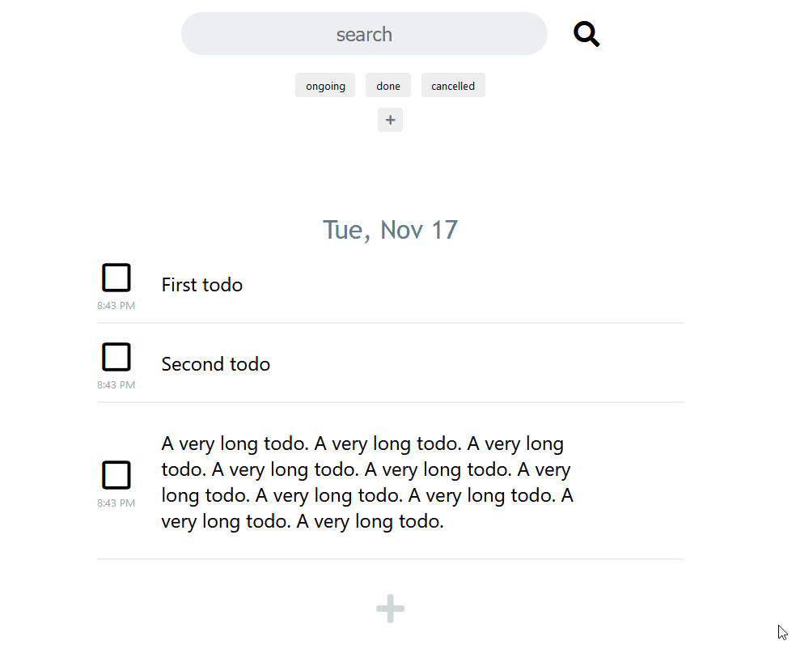
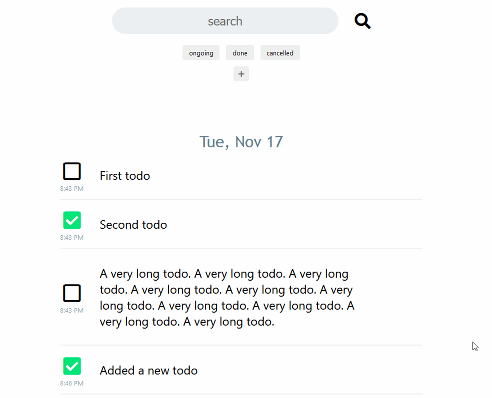
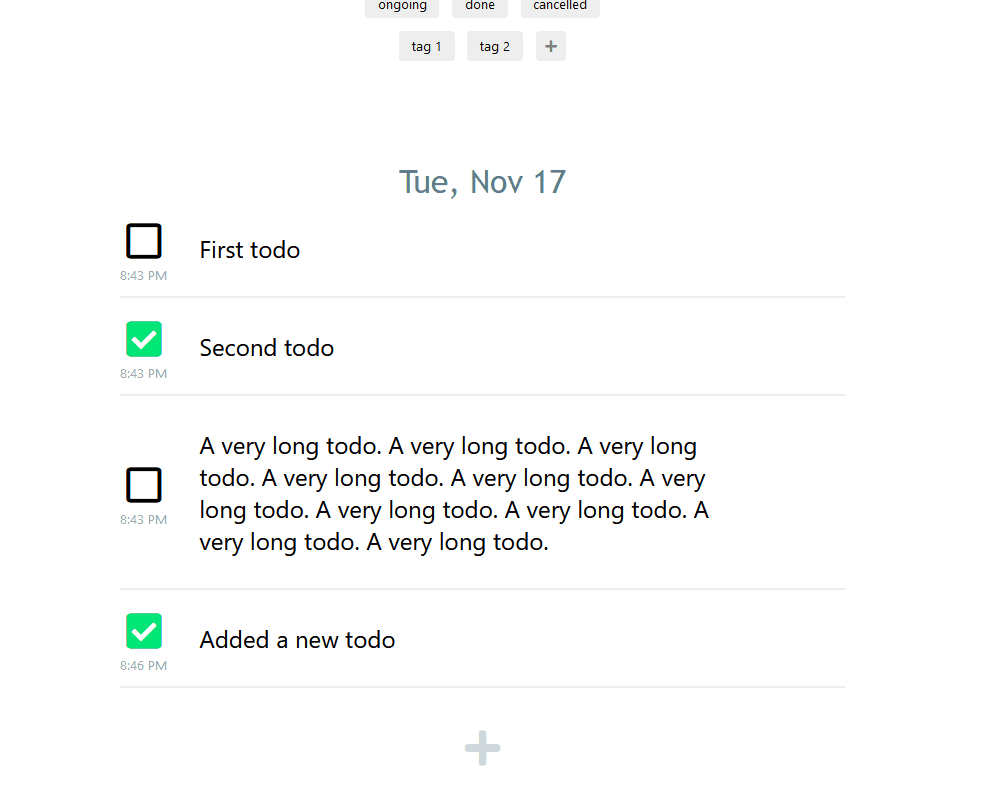
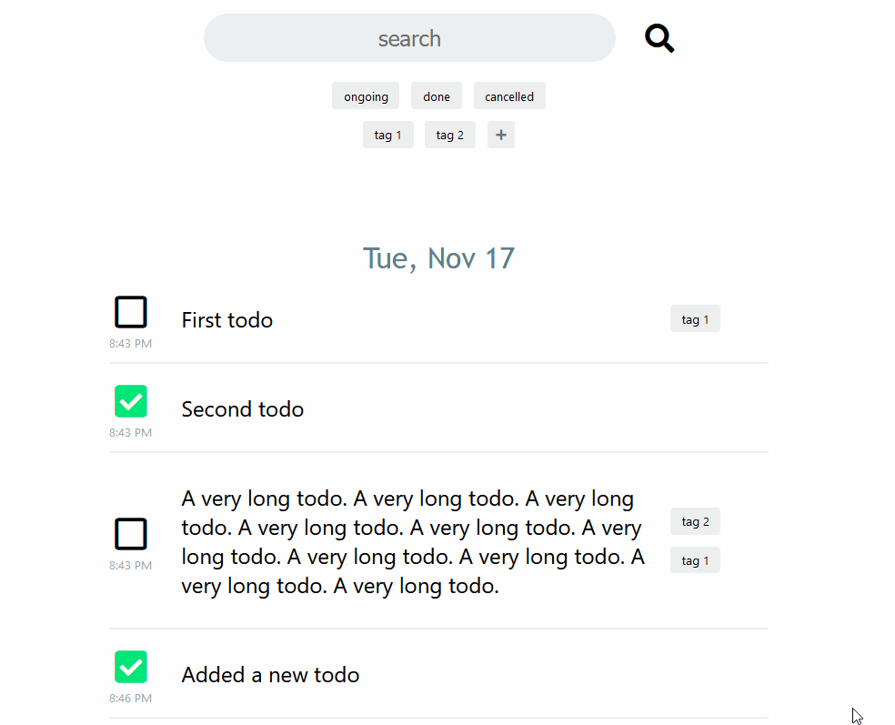
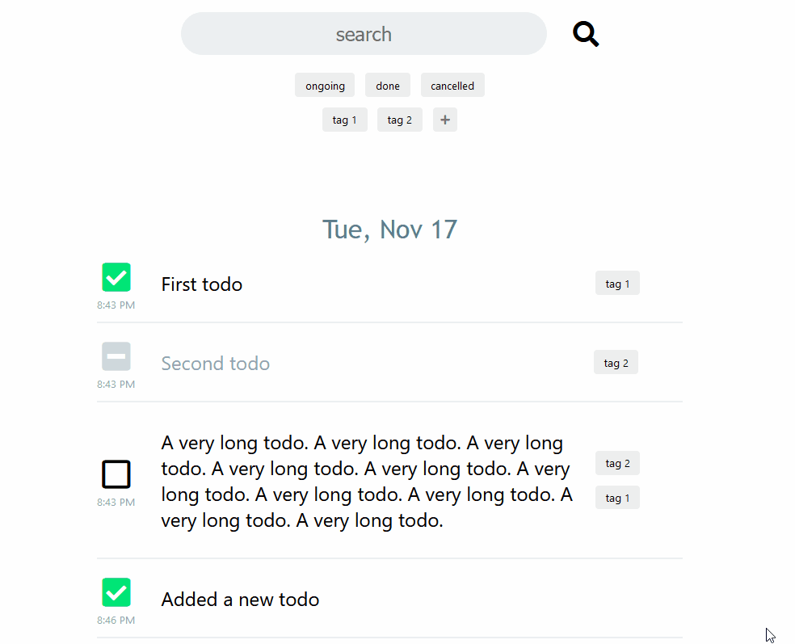
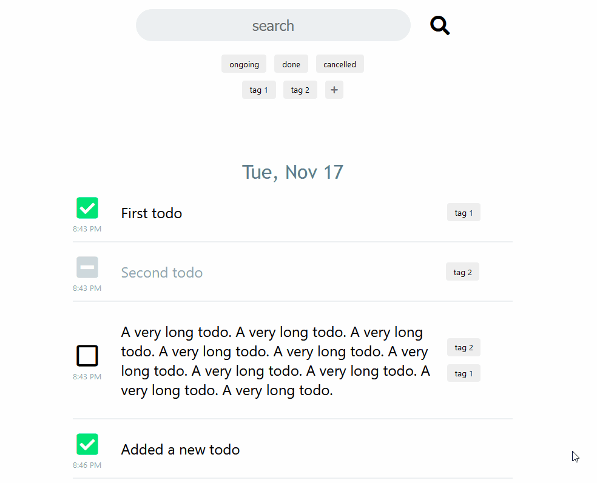

# Minimalistic TODO app

Backend written in `python` with `fast-api`.

Frontend written in `typescript` with `angular`.


## Features

Create todo's. Todo's have 3 states

* ongoing
* done
* cancelled



Todo's are grouped by day of creation.

---

Add tags



---

Apply tags to todo's.



---

Filter by state



---

Filter by tags



---

Search todo contents



## Building

### Frontend

**Prerequisites**: `node.js` and `npm` installed

Run the following commands

```bash
cd frontend
npm install
npm run build:prod
```

This will build the frontend into `frontend/dist/frontend` folder.


### Backend

**Prerequisites**: `python 3.8` installed.

Run the following commands to create a python virtual environment.

```bash
python -m venv <venv-path>
```

You can activate the virtual environment using

Linux

```bash
source <venv-path>/bin/activate
```

Windows

```cmd
<venv-path>\Scripts\activate
```

Once the virtual environment is active, run the following commands.

```bash
cd backend
pip install poetry
poetry install --no-dev
```

## Running the application

Add a file `backend/.env` with the following contents

```
db_path=prod.db
frontend_path=<path-to-repo>/frontend/dist/frontend
```

Activate the python virtual environment and run

```bash
cd backend
uvicorn app:app
```
This will serve the application on `localhost:8000/todo`. A file called `prod.db` which
will act as a database for this application.


## Running the tests

Activate the python virtual environment and run

```bash
cd backend
poetry install
pytest --cov=app tests
```
